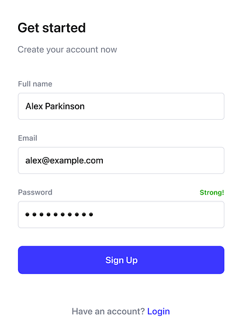

### **Úkol: Vytvoření Registračního Formuláře**

**Zadání úkolu:**

Vytvořte jednoduchou webovou stránku s názvem "Registrace", která bude obsahovat následující části:

1. **Formulář pro registraci uživatele**:
    - Všechny vstupní pole musí být správně ošetřeny pomocí HTML validace (např. `required`, `type` atributy).
    - Vytvořte formulář přesně podle přiloženého obrázku, který bude obsahovat následující pole:
        - **Full name**: Textové pole pro celé jméno uživatele.
        - **Email**: Pole pro emailovou adresu (`type="email"`).
        - **Password**: Heslo (`type="password"`).
        - **Tlačítko**: Tlačítko pro odeslání formuláře s textem **Sign Up**.
    - Formulář bude také obsahovat odkaz **Login** pro přihlášení, umístěný pod tlačítkem odeslat.

2. **Stylizace Pomocí `style` Atributu:**
    - Stylizace musí přesně odpovídat návrhu z přiloženého obrázku. Nastavte:
        - **Zarovnání** všech prvků na střed stránky.
        - **Šířku** textových polí tak, aby byla přiměřená (např. 300px).
        - **Barvu tlačítka** na modrou a text bílý.
        - **Styl textu** a **rozložení prvků** přesně podle návrhu.

**Úkoly navíc:**

1. **Přidejte Pole pro Opakování Hesla**:
    - Přidejte nové pole pro opakování hesla, které zajistí, že uživatel zadá heslo správně dvakrát.

2. **Přidejte Specifické Inputy**:
    - Přidejte vstupní pole pro zjištění věku (`type="number"`) nebo oblíbené barvy (`type="color"`) uživatele.

3. **Přidejte Checkbox pro Přijetí Podmínek**:
    - Přidejte checkbox, který uživatel musí zaškrtnout pro potvrzení, že souhlasí s podmínkami registrace (např. "Souhlasím s podmínkami").